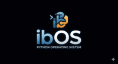

Man,this project took me 2 days to make. Maybe this might look short timeline but I coded for a long time with maybe 1-2 hours break. I slept 3 hours for this project to be done.
The reason I did this project was to make my wish become real with the help of Allah(swt).
Well,that's it.I've made it.Maybe I might add more features to make.Just open "bios.py" file and then voila!
There's only a few things you can see but you can call it an "OS".
